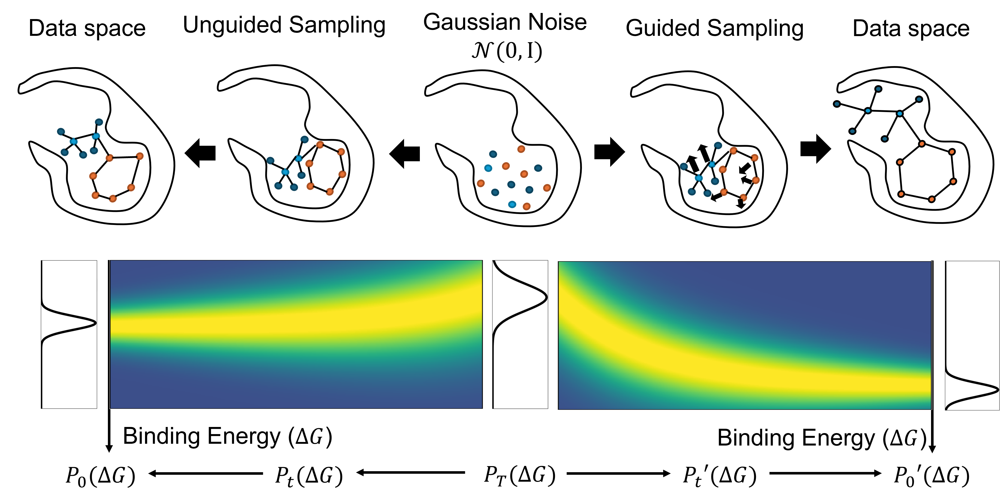

# General Binding Affinity Guidance for Diffusion Models in Structure-Based Drug Design



Official codebase for the paper:  
**"General Binding Affinity Guidance for Diffusion Models in Structure-Based Drug Design"**  
[[arXiv:2406.16821](https://arxiv.org/abs/2406.16821)]

---

**BADGER** is a general binding affinity guidance framework for diffusion models in structure-based drug discovery (SBDD). It introduces two complementary strategies:

- **Classifier Guidance:** Gradient-based plug-and-play guidance using a pretrained binding affinity classifier.
- **Classifier-Free Guidance:** Guidance integrated directly into the diffusion model's training, removing the need for external classifiers.

These methods enable general binding affinity-guided molecular design using diffusion models.

> This code builds heavily on [TargetDiff](https://github.com/guanjq/targetdiff) and [DecompDiff](https://github.com/bytedance/DecompDiff). We thank the authors for their contributions.

---

## 📦 Setup

### 1. Environment Setup

Create the conda environment:

```bash
conda env create -f BADGER.yml
```

---

### 2. Download Data & Checkpoints

#### 📁 Data

Please follow the instructions from [DecompDiff](https://github.com/bytedance/DecompDiff).  
Place the downloaded data under the `./data` directory.

#### 🧠 Checkpoints

Download pretrained checkpoints from:  
**[Zenodo placeholder link]** (to be updated)

---

## 🚀 Usage

### Classifier Guidance (on TargetDiff)

#### 1. Train a Binding Affinity Classifier

```bash
python scripts/train_classifier.py configs/training_EGTF.yml
```

#### 2. Sample with Classifier Guidance (on TargetDiff)

```bash
python scripts/sample_diffusion.py configs/sampling.yml -si {user_responsibility: start_id} -ei {user_responsibility: end_id}
```
##### note: {start_id} & {end_id} range from 0-99

#### 3. Sample with Multi-Constraints Classifier Guidance (on TargetDiff)

```bash
python scripts/sample_diffusion_multi.py configs/sampling_multi.yml
```

---

### Classifier-Free Guidance (on TargetDiff)

#### 1. Train a Conditional Diffusion Model

```bash
python scripts/train_diffusion_clsf_free.py configs/training_clsf_free.yml --wandb True
```

#### 2. Sample with Classifier-Free Guidance (on TargetDiff)

```bash
python scripts/sample_diffusion_clsf_free.py configs/sample_clsf_free.yml -si {user_responsibility: start_id} -ei {user_responsibility: end_id} \
  --result_path {user_responsibility: path_to_result_folder}
```
##### note: {start_id} & {end_id} range from 0-99

---

## 📊 Evaluation

### 1. Use Pre-Sampled Molecules (for reproduction)

Download from:  
**[Zenodo placeholder link]** (to be updated)

### 2. Evaluate Your Own Samples

#### Get Vina-related Metrics

```bash
python scripts/sample_diffusion.py configs/sampling.yml -si {user_responsibility: start_id} -ei {user_responsibility: end_id} \
  --result_path {user_responsibility: path_to_result_folder}
```
##### note: {start_id} & {end_id} range from 0-99

#### Get Steric Clashes and Redocking RMSD

```bash
python scripts/posecheck.py
```

---

## 🧪 DecompDiff Part

Please switch to decompdiff branch and reproduce the result according the instruction there
```bash
git checkout decompdiff
```

---

## 📚 Citation

If you find our work useful, please consider citing:

```bibtex
@misc{jian2024generalbindingaffinityguidance,
  title={General Binding Affinity Guidance for Diffusion Models in Structure-Based Drug Design},
  author={Yue Jian and Curtis Wu and Danny Reidenbach and Aditi S. Krishnapriyan},
  year={2024},
  eprint={2406.16821},
  archivePrefix={arXiv},
  primaryClass={cs.LG},
  url={https://arxiv.org/abs/2406.16821}
}
```

please also cite the related foundational works:

```bibtex
@misc{guan20233dequivariantdiffusiontargetaware,
  title={3D Equivariant Diffusion for Target-Aware Molecule Generation and Affinity Prediction},
  author={Jiaqi Guan and Wesley Wei Qian and Xingang Peng and Yufeng Su and Jian Peng and Jianzhu Ma},
  year={2023},
  eprint={2303.03543},
  archivePrefix={arXiv},
  primaryClass={q-bio.BM},
  url={https://arxiv.org/abs/2303.03543}
}

@misc{guan2024decompdiffdiffusionmodelsdecomposed,
  title={DecompDiff: Diffusion Models with Decomposed Priors for Structure-Based Drug Design},
  author={Jiaqi Guan and Xiangxin Zhou and Yuwei Yang and Yu Bao and Jian Peng and Jianzhu Ma and Qiang Liu and Liang Wang and Quanquan Gu},
  year={2024},
  eprint={2403.07902},
  archivePrefix={arXiv},
  primaryClass={q-bio.BM},
  url={https://arxiv.org/abs/2403.07902}
}
```

---

Feel free to open issues or discussions for help or feedback!
